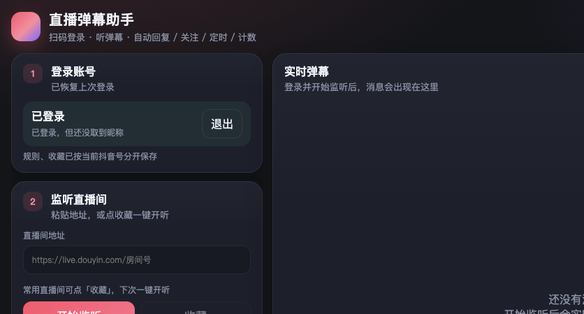
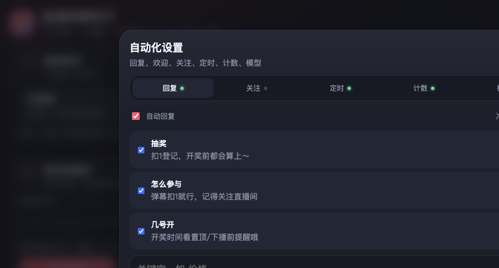
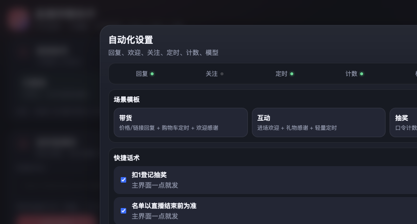
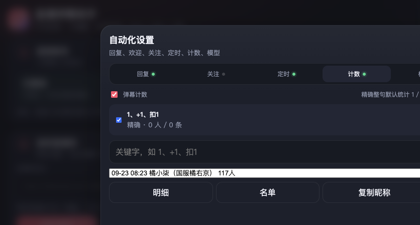

# 直播弹幕助手

用自己的抖音账号听直播、回弹幕、做场控。

当前版本：**v1.0.0**  
仓库仅提供安装包下载，**不公开源码**。  
国内用户优先从 Gitee 下载：[jiangbo/dy_live_tool](https://gitee.com/jiangbo/dy_live_tool)  
GitHub：[myhgjb666/dy_live_tool](https://github.com/myhgjb666/dy_live_tool)  
请使用自己的账号，只辅助自己有权操作的直播间。本软件不是抖音官方产品，请遵守平台规则与当地法律。

## 下载 Windows 安装包

到 Releases 下载带版本号的文件，例如：

- **`LiveAssistant-v1.0.0.exe`**（推荐，文件名含版本，方便区分）
- 或同内容的 `LiveAssistant.exe`

- Gitee：https://gitee.com/jiangbo/dy_live_tool/releases
- GitHub：https://github.com/myhgjb666/dy_live_tool/releases

若 Gitee 附件因体积限制无法上传，请改从 GitHub Releases 下载同名文件。

双击运行即可。规则、收藏、多账号配置写在 exe 同目录的 `datas/`。

## 界面预览

### 主界面

登录、监听、收藏、实时弹幕同屏；右上角打开「自动化设置」。

### 自动化 · 关键字回复

关键字固定回复 / AI 回复、进场欢迎、礼物感谢、忽略名单。

### 自动化 · 更多

场景模板（带货 / 互动 / 抽奖）、快捷话术、发送排队与优先级。

### 自动化 · 弹幕计数

口令人数统计，可导出明细 / 名单、复制昵称。

## 功能一览

| 功能 | 说明 |
| --- | --- |
| 软件账号 | 注册 / 登录后使用；本设备首次注册 1 天试用 |
| 抖音扫码 | 用自己的抖音 App 登录 |
| 听直播间 | 收弹幕、礼物、进场等；显示在线与贡献榜 |
| 直播间收藏 | 常用房间一键开听 |
| 多账号配置 | 主号 / 小号规则与收藏分开，扫码换号自动切换 |
| 关键字回复 | 固定话术或大模型；支持 `{昵称}`、多句随机 |
| 进场欢迎 / 礼物感谢 | 同一人一场只说一次 |
| 关键字关注 | 命中关键字关注发送者 |
| 定时弹幕 | 按间隔轮流发送 |
| 快捷话术 | 主界面一键发送 |
| 发送排队 | 冷却中按优先级排队，减少刷屏 |
| 弹幕计数 | 统计扣 1 等口令，导出名单 |
| 本场简报 | 数据汇总，可复制；未命中词提示 |
| 场景模板 | 带货 / 互动 / 抽奖一键套用 |
| 大模型 | 兼容 OpenAI `/v1` 接口，密钥仅存本机 |

## 第一次使用

1. 用软件账号登录或注册（验证码为图片计算结果）。
2. 再用抖音 App 扫码。
3. 粘贴直播间地址点「开始监听」，或点收藏一键开听。
4. 右上角「自动化设置」里配置回复、关注、定时、计数等。

## 版本说明

每个正式版对应一个 GitHub Release 标签，例如 `v1.0.0`、`v1.0.1`。  
请以下载文件名中的版本号为准，便于区分新旧安装包。

## 说明

- 一账号绑定一台设备。到期后由管理员在后台续期。
- 不要用于骚扰、刷量、违规引流或未授权采集他人数据。
- 接口与页面结构可能随平台更新变化。
